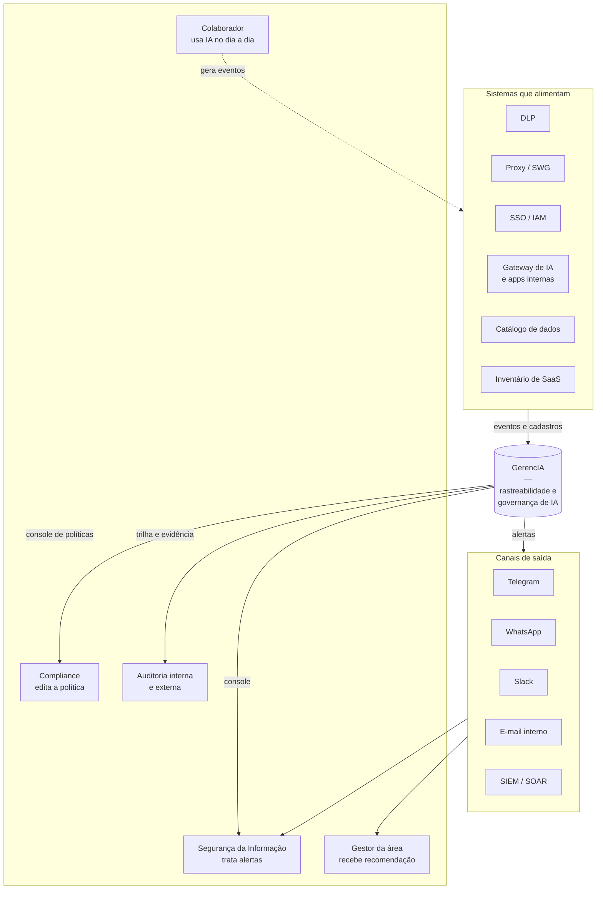
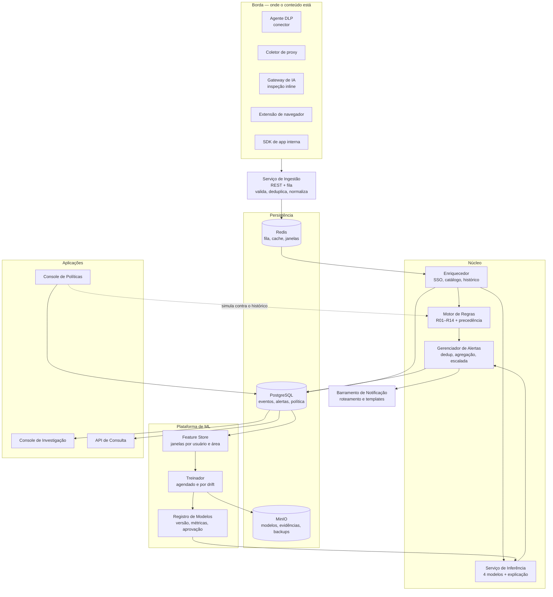
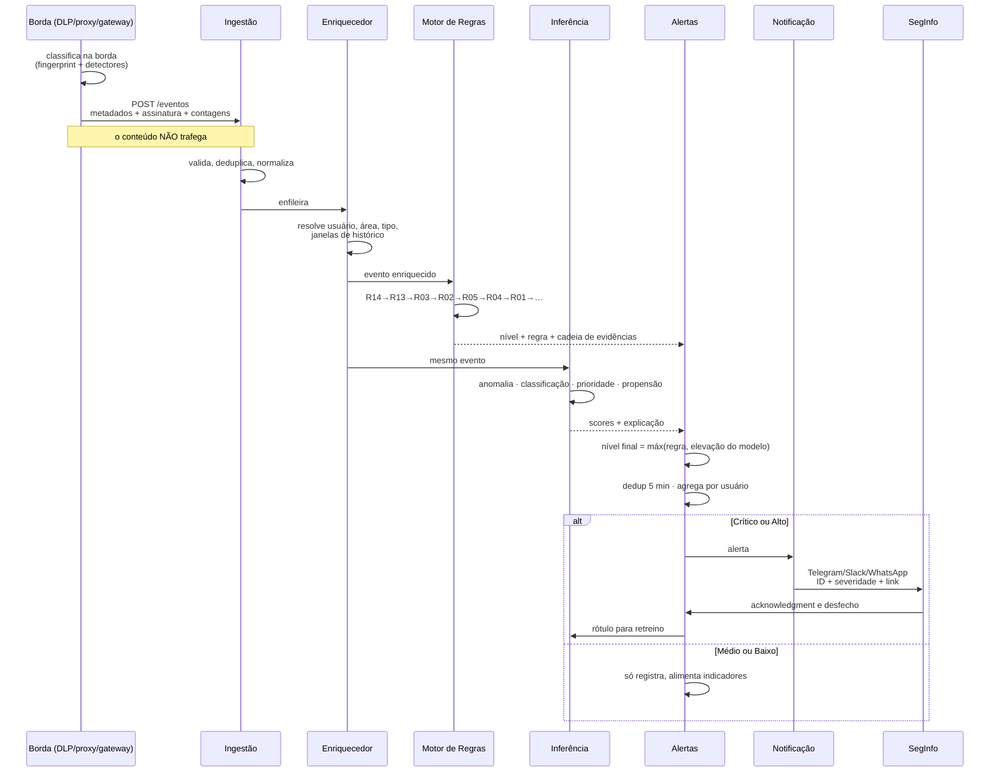
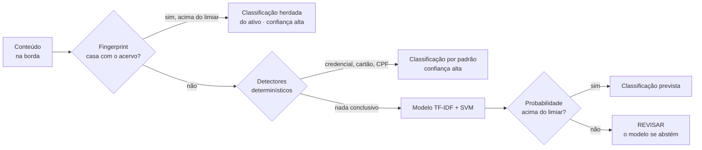
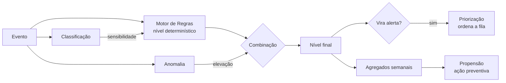
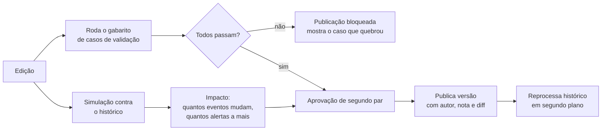
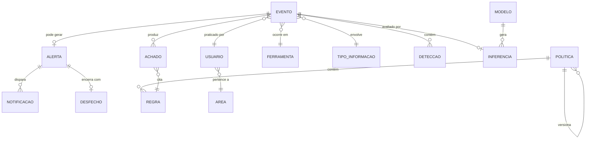
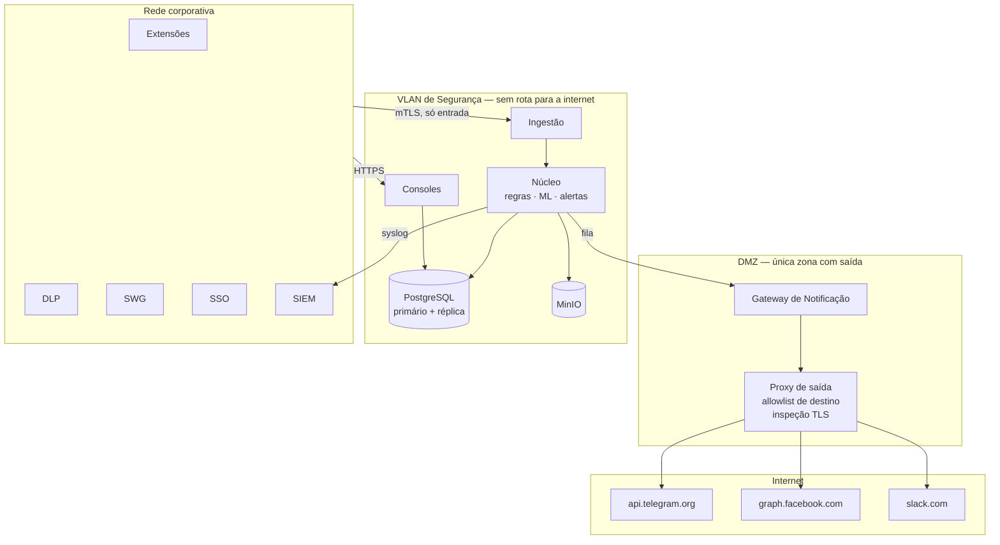

# GerencIA — Arquitetura de Implantação

**Monitoramento de uso de IA com regras determinísticas e aprendizado de máquina clássico,
em servidor dentro da rede.**

Desafio 2 · Stark Bank · versão de 16/09/2026.

> Esta é a arquitetura de produção. O protótipo documentado em
> `GerencIA-documento-do-projeto.md` implementa a espinha dorsal dela — importação, motor de
> regras, auditoria e console — sobre a base oficial do desafio.

---

## Sumário

1. [Princípios](#1-princípios)
2. [Visão de contexto](#2-visão-de-contexto)
3. [Visão de contêineres](#3-visão-de-contêineres)
4. [O caminho de um evento](#4-o-caminho-de-um-evento)
5. [Camada de coleta](#5-camada-de-coleta)
6. [Motor de regras](#6-motor-de-regras)
7. [Os quatro modelos de IA clássica](#7-os-quatro-modelos-de-ia-clássica)
8. [Governança de modelo](#8-governança-de-modelo)
9. [Console de políticas](#9-console-de-políticas)
10. [Barramento de notificação](#10-barramento-de-notificação)
11. [Modelo de dados](#11-modelo-de-dados)
12. [Segurança e privacidade](#12-segurança-e-privacidade)
13. [Topologia de rede on-premise](#13-topologia-de-rede-on-premise)
14. [Dimensionamento](#14-dimensionamento)
15. [Observabilidade e SLOs](#15-observabilidade-e-slos)
16. [Roadmap de implantação](#16-roadmap-de-implantação)
17. [Decisões de arquitetura](#17-decisões-de-arquitetura)
18. [Riscos](#18-riscos)

---

## 1. Princípios

Sete regras que explicam quase todas as decisões deste documento.

**1. A regra é o piso; o modelo é o teto.**
O motor determinístico decide sozinho o nível mínimo de risco. O modelo **nunca rebaixa** o
que uma regra estabeleceu — só pode elevar, priorizar ou sinalizar o que a regra não vê. Se
amanhã o modelo for desligado, a governança continua funcionando com a política escrita.

**2. Explicabilidade não é opcional.**
Tudo que gera alerta traz a razão em linguagem natural. Vale para a regra (qual regra, qual
texto, qual ação) e vale para o modelo (quais variáveis desviaram e quanto). Um modelo que não
sabe explicar não entra em produção — o que descarta arquiteturas de aprendizado profundo aqui,
e é parte do motivo para usar IA clássica.

**3. O conteúdo não sai do lugar onde nasce.**
A classificação roda na borda. O que trafega pela rede é metadado, assinatura e contagem.
A solução de governança não pode virar o maior repositório de dado sensível da empresa.

**4. Nada sai para a internet, exceto notificação, e só metadado.**
Uma única rota de saída, na DMZ, com allowlist de destino. E a mensagem que sai carrega
identificador e severidade — nunca o conteúdo, nunca o nome do documento crítico.

**5. A política vive fora do código.**
Regras, níveis, ações e limiares são dado versionado, editável por Compliance, com histórico de
quem mudou o quê. O código tem a **ordem de precedência** e a mecânica de aplicação.

**6. Toda mudança de política é simulada antes de valer.**
Antes de publicar, a mudança roda contra o histórico e contra o gabarito de casos de validação.
Uma política que quebra um caso oficial não publica.

**7. Predição de risco é insumo preventivo, nunca punitivo.**
O modelo de propensão gera recomendação de treinamento e revisão de acesso. Não entra em
avaliação de desempenho, e isso é regra escrita, com o dado tecnicamente segregado de RH.

---

## 2. Visão de contexto



O colaborador não interage com a GerencIA — exceto por um ponto: a extensão de navegador, que
oferece o mascaramento no momento do colar. Esse é o único contato, e é deliberadamente uma
ajuda, não um bloqueio.

---

## 3. Visão de contêineres



### Os serviços, um a um

| Serviço | Responsabilidade | Stack sugerida |
|---|---|---|
| **Ingestão** | Recebe eventos dos coletores, valida esquema, deduplica por chave idempotente, normaliza vocabulário | Python + FastAPI, ou Go se o volume justificar |
| **Enriquecedor** | Resolve usuário → área/cargo/perfil pelo SSO, tipo de informação pelo catálogo, calcula janelas de histórico | Python |
| **Motor de Regras** | Aplica R01–R14 na ordem de precedência, produz nível e cadeia de evidências | Python — é o código do protótipo, promovido a serviço |
| **Inferência** | Roda os quatro modelos e devolve score + explicação | Python + scikit-learn / LightGBM, servido com FastAPI |
| **Gerenciador de Alertas** | Decide o que vira alerta, deduplica, agrega, escala por SLA, registra desfecho | Python |
| **Barramento de Notificação** | Roteia por severidade, área e plantão; aplica templates; retry e DLQ | Python + Redis Streams |
| **Console de Investigação** | O painel que o protótipo já entrega | HTML/JS estático servido por Nginx |
| **Console de Políticas** | Edição, simulação e versionamento da política | HTML/JS + API |
| **Treinador** | Monta dataset, treina, avalia, registra, promove | Python + APScheduler ou Airflow |

Tudo em Python no núcleo, de propósito: é a linguagem do scikit-learn, e ter um único runtime
reduz a superfície de manutenção de um time pequeno.

---

## 4. O caminho de um evento



**O ponto que fecha o ciclo:** o desfecho do alerta volta como rótulo. É isso que faz o modelo
de priorização melhorar — e é exatamente a instrumentação que a base oficial não tem hoje
(achado A-05).

---

## 5. Camada de coleta

Nenhuma fonte sozinha vê tudo. A base oficial já prova isso: dos 650 eventos, 177 vieram de
DLP, 163 de log de aplicação, 162 de proxy e 148 de registro manual.

| Coletor | Como funciona | Cobre | Não cobre |
|---|---|---|---|
| **Gateway de IA** | Proxy reverso pelo qual as chamadas corporativas de LLM passam | Tudo que é corporativo, com conteúdo inspecionável | Ferramenta acessada direto pelo navegador |
| **Conector de DLP** | Assina os eventos de política do DLP existente | Detecção madura de padrão sensível | O que o DLP não inspeciona (TLS não interceptado) |
| **Coletor de proxy/SWG** | Lê o log do secure web gateway, correlaciona domínio × usuário | Existência e volume — descobre ferramenta não declarada | Conteúdo |
| **Extensão de navegador** | Intercepta colar/enviar nos domínios de IA, classifica na borda, oferece mascaramento | O shadow AI real, no momento em que acontece | Máquina não gerenciada |
| **SDK de aplicação** | Biblioteca que apps internas chamam ao usar LLM | Uso programático, com finalidade declarada | Nada — é opt-in por app |
| **Concessões OAuth** | Lê o IdP e lista apps de IA com acesso a Drive, e-mail, calendário | Ferramenta que ninguém declarou e tem acesso persistente | Uso sem OAuth |
| **Registro manual** | Formulário no console | O que escapou de tudo | O que a pessoa não quer declarar |

### O contrato de evento

Todo coletor entrega o mesmo objeto. É o que permite trocar um coletor sem tocar no núcleo.

```json
{
  "id_externo": "dlp-2026-09-16-8831",
  "ts": "2026-09-16T14:22:10-03:00",
  "usuario": "USR-0064",
  "ferramenta": { "dominio": "chat.exemplo.ai", "id": "IA-04" },
  "informacao": {
    "tipo_id": "INF-04",
    "sensibilidade": "Confidencial",
    "confianca": 0.93,
    "origem_classificacao": "fingerprint"
  },
  "forma_uso": "Trecho de documento",
  "qtd_itens": 5,
  "finalidade": "Classificar conteúdo",
  "assinatura": { "simhash": "0x9f2b...", "minhash_id": "sig-44821" },
  "deteccoes": [ { "tipo": "cpf", "contagem": 3, "validado": true } ],
  "mascaramento_oferecido": true,
  "mascaramento_aceito": false,
  "origem_registro": "DLP/segurança"
}
```

Note o que **não** está aqui: o texto. Nem um trecho. A `assinatura` identifica o documento; as
`deteccoes` dizem o tipo e a contagem, nunca o valor.

---

## 6. Motor de regras

É o código do protótipo, promovido a serviço. Continua lendo a política de fora — agora do
banco, alimentado pelo console, em vez da planilha.

```
POST /avaliar
{ evento }                     → { nivel, regra_principal, achados[], lacuna }

POST /simular
{ politica_candidata, eventos[] } → { resultados[], impacto, validacao }
```

O endpoint `/simular` é o que dá ao console de políticas a capacidade de mostrar consequência
antes de publicar. Ele roda a política candidata contra o histórico inteiro e contra o gabarito.

**Contrato de estabilidade:** o motor é puro. Mesma política + mesmo evento = mesmo resultado,
sempre. Não consulta modelo, não consulta relógio, não tem estado. É o que permite reprocessar
o histórico inteiro quando a política muda e comparar maçã com maçã.

---

## 7. Os quatro modelos de IA clássica

Todos rodam em CPU, treinam em minutos, cabem num contêiner e explicam o que fizeram.
Nenhum é rede neural profunda — e a razão é o princípio 2, não preconceito técnico: um alerta
que a pessoa avaliada não consegue contestar é um alerta que Compliance não pode usar.

### 7.1 Detecção de anomalia comportamental

**Pergunta que responde:** este uso é estranho *para esta pessoa*, mesmo que nenhuma regra
tenha sido violada?

| | |
|---|---|
| **Algoritmo** | Isolation Forest (não supervisionado) + z-score robusto por MAD para as variáveis individuais |
| **Unidade** | Evento, com contexto das janelas de 7, 30 e 90 dias do usuário e do grupo de pares |
| **Treino** | Não supervisionado, sobre a própria base. Retreino semanal |
| **Saída** | `score_anomalia` 0–100 + as três variáveis que mais desviaram, em texto |

**Variáveis (features):**

| Grupo | Variáveis |
|---|---|
| Volume | eventos no dia ÷ mediana de 30 dias do usuário; itens no evento ÷ p95 do usuário |
| Tempo | proporção de eventos fora de horário; intervalo desde o evento anterior; rajada em 10 min |
| Ferramenta | novidade (primeira vez que este usuário usa); entropia da distribuição de ferramentas; proporção em não aprovada |
| Informação | novidade do tipo; sensibilidade máxima ÷ habitual do usuário; diversidade de tipos no dia |
| Pares | desvio em relação à mediana da área (mesma área, mesmo cargo) |
| Contexto | dia da semana; proximidade de fechamento contábil, divulgação de resultado ou desligamento |

**Por que Isolation Forest.** Anomalia é rara e não rotulada — não há como treinar um
classificador supervisionado sem incidentes confirmados, que são poucos. IF isola pontos raros
em poucas divisões, treina em segundos, e o caminho de isolamento é inspecionável. Alternativa
avaliada: LOF, descartado por custo em consulta e por degradar com dimensionalidade.

**Explicabilidade.** Para cada evento sinalizado, recalcula-se o score removendo uma variável de
cada vez; as três de maior impacto viram a frase: *"volume 6× acima da mediana de 30 dias desta
pessoa · primeira vez usando esta ferramenta · 23h em sábado"*.

**Armadilha conhecida.** Pessoa nova não tem baseline, e tudo parece anômalo. Mitigação: durante
os primeiros 30 dias, o baseline é o do grupo de pares, com o score marcado como
*"baseline de pares — pessoa sem histórico"*.

### 7.2 Classificação automática da informação

**Pergunta que responde:** que tipo de informação é esta, e qual a sensibilidade — sem depender
de alguém preencher um formulário?

Este modelo existe para substituir os 148 eventos por registro manual e reduzir a dependência
do DLP. Ele é a resposta ao dicionário de dados da planilha, que diz que a origem de
`Tipo informação` e `Sensibilidade` é *"Classificador/DLP"*.

**Arquitetura em duas etapas — o modelo só vê o que sobra:**



| | |
|---|---|
| **Algoritmo** | TF-IDF (n-gramas de palavra 1–2 e de caractere 3–5) → Linear SVM com calibração de Platt. LightGBM como alternativa quando houver variáveis estruturadas suficientes |
| **Alvos** | `tipo_informacao` (20 classes) e `sensibilidade` (4 classes ordinais) |
| **Treino** | Rótulos do DLP, do catálogo de dados e da revisão humana. Aprendizado ativo: o que o modelo marca como REVISAR e o humano resolve vira exemplo |
| **Onde roda** | Na borda, dentro da extensão e do gateway. O modelo linear cabe em poucos megabytes e responde em milissegundos |

**Por que clássico e não um modelo de linguagem.** Três razões, nesta ordem: o conteúdo não pode
sair da borda; os pesos por termo são auditáveis (*"classificou como Confidencial porque
'cláusula de rescisão' e 'CNPJ' pesaram"*); e roda em CPU dentro do navegador.

**Custo assimétrico.** Subestimar sensibilidade é muito pior do que superestimar. O treino usa
matriz de custo — errar Crítica→Interna pesa dez vezes mais que Interna→Crítica — e o limiar de
decisão é calibrado para a taxa de subestimação aceita, não para acurácia.

**A abstenção é uma funcionalidade.** Abaixo do limiar de confiança o modelo devolve REVISAR,
que é exatamente o comportamento da regra R13. Um classificador que sempre responde é um
classificador que às vezes mente.

### 7.3 Priorização da fila de alertas

**Pergunta que responde:** dos alertas abertos, quais merecem atenção primeiro?

| | |
|---|---|
| **Algoritmo** | LightGBM com objetivo de ranqueamento (LambdaRank); alternativa simples: classificação binária e ordenação por probabilidade |
| **Rótulo** | O desfecho do alerta: incidente confirmado, falso positivo, orientação, sem ação |
| **Treino** | Semanal, sobre a janela de 180 dias |
| **Saída** | Posição na fila + a razão (*"padrão semelhante a 12 alertas confirmados nos últimos 90 dias"*) |

**Pré-requisito que hoje não existe.** Este modelo depende do carimbo de desfecho — que é
justamente a proposta R17 da auditoria. Sem isso, não há rótulo e não há modelo. **É a primeira
instrumentação a implantar**, e ela precisa preceder o modelo em pelo menos um trimestre para
acumular exemplos.

**Viés de retroalimentação, e como tratá-lo.** Se o modelo despriorizar uma classe de alerta,
ela nunca é tratada, nunca vira rótulo positivo, e o modelo aprende que ela não importa. É um
ciclo que se fecha sozinho e é o erro mais comum deste tipo de sistema. Três mitigações:

- **Exploração:** 5% da fila é sorteada aleatoriamente, não ordenada pelo modelo;
- **Amostragem de fundo:** uma amostra fixa da cauda é revisada toda semana;
- **Monitoramento de cobertura:** se alguma regra deixa de aparecer no topo por 30 dias, alarme.

**O modelo ordena, nunca descarta.** Todo alerta continua na fila e continua contando nos
indicadores. Priorização muda a ordem de leitura, não a existência do registro.

### 7.4 Risco preditivo por usuário e área

**Pergunta que responde:** onde vale investir treinamento e revisão de acesso antes que o
incidente aconteça?

| | |
|---|---|
| **Algoritmo** | Regressão logística regularizada (L2). Coeficiente por variável é diretamente legível |
| **Alvo** | Probabilidade de gerar ao menos um evento Crítico nos próximos 30 dias |
| **Unidade** | Usuário e área, recalculado semanalmente |
| **Saída** | Probabilidade + as variáveis que mais contribuíram + a ação recomendada |

**Variáveis:** agregados de 90 dias — volume, diversidade de ferramentas, proporção em não
aprovada, proporção de informação sensível, alertas anteriores por desfecho, tempo desde o
último treinamento de segurança, perfil de acesso, modelo de trabalho.

**Por que regressão logística e não gradient boosting.** Aqui a saída vai para um gestor tomar
decisão sobre uma pessoa. O coeficiente de uma logística é um número que se explica numa frase.
Ganhar dois pontos de AUC com um modelo que exige SHAP para ser lido não compensa.

**As três salvaguardas, que são de governança e não técnicas:**

1. **Uso exclusivamente preventivo.** A saída recomenda treinamento, revisão de acesso ou
   conversa de orientação. Não entra em avaliação de desempenho, e o dado é tecnicamente
   segregado dos sistemas de RH.
2. **Direito de contestação.** A pessoa pode ver o próprio score e as variáveis que o
   compuseram. Score que a pessoa não pode ver é score que ninguém pode defender.
3. **Monitoramento de paridade.** Se o score concentra numa área, pode estar medindo volume de
   trabalho e não risco. Métrica de paridade entre áreas e cargos, revisada trimestralmente, com
   gatilho de recalibração.

### Como os quatro se combinam



**A regra de combinação, escrita por extenso:**

```
nivel_final = máximo( nivel_regra , elevação_por_anomalia )

onde elevação_por_anomalia:
  score ≥ 95  e  informação sensível  → eleva um nível, no máximo até Alto
  score ≥ 95  e  informação não sensível → registra sinal, não eleva
  score <  95 → não eleva

e nunca, em nenhuma hipótese, nivel_final < nivel_regra
```

O teto de Alto é deliberado: **o modelo não cria evento Crítico sozinho.** Crítico exige regra —
porque Crítico dispara bloqueio e notificação a CISO e DPO, e essa decisão precisa de base
determinística, não estatística.

---

## 8. Governança de modelo

| Controle | Como |
|---|---|
| **Registro** | Todo modelo tem versão, hash do dataset, métricas, data, e quem aprovou |
| **Modo sombra** | Roda em paralelo por 30 dias sem gerar alerta; compara-se o que teria feito com o que o humano fez |
| **Promoção** | Só com aprovação nominal de Segurança e Compliance, registrada |
| **Monitoramento de deriva** | PSI por variável, semanal. PSI > 0,2 dispara revisão; > 0,25 dispara retreino |
| **Degradação** | Queda de métrica além do limiar reverte automaticamente para a versão anterior |
| **Reversão** | Um comando volta à versão anterior. O registro guarda os artefatos |
| **Desligamento** | Chave que desliga cada modelo individualmente. Com todos desligados, o sistema opera só com regras — e continua atendendo o desafio |
| **Auditoria** | Toda inferência que gerou alerta guarda a versão do modelo e o vetor de variáveis. Um alerta de seis meses atrás pode ser reproduzido |

O último item merece ênfase: **reprodutibilidade**. Se um alerta virou processo disciplinar, é
preciso poder reproduzir exatamente a decisão daquele dia, com aquele modelo, com aquelas
variáveis. Guardar só o score não basta.

---

## 9. Console de políticas

A aplicação que Compliance usa, separada do console de investigação e com RBAC próprio.

**O que edita:** as regras (nível, ação, ativa/inativa), a ordem de precedência, os limiares
(volume, confiança do classificador, corte de anomalia), o cadastro de ferramentas e status, os
níveis de classificação, e a matriz de roteamento de notificação.

**O que faz antes de deixar publicar:**



**Quatro garantias que o console dá:**

1. **Simulação obrigatória.** Ninguém publica sem ver o impacto sobre o histórico.
2. **Gabarito como trava.** Política que quebra um caso de validação oficial não publica.
3. **Segundo par.** Publicação exige aprovação de outra pessoa — quem edita não aprova.
4. **Versionamento com diff.** Toda versão guarda autor, data, nota e o que mudou. Reversão em
   um clique.

> O protótipo funcional deste console acompanha este documento, com os três primeiros itens
> implementados sobre os 650 eventos da base oficial.

---

## 10. Barramento de notificação

### A regra que define o desenho

**A mensagem que sai da rede não carrega informação sensível.** Ela leva identificador do
alerta, severidade, área e um link para o console interno. Nunca o conteúdo, nunca o nome do
documento quando ele é Crítico, nunca o nome da pessoa em canal de grupo.

Isso não é excesso de zelo: um alerta dizendo *"Fulano enviou o Relatório de Resultados do 3º
trimestre para uma IA pública"* enviado por WhatsApp **é, ele mesmo, o vazamento.**

### Os canais

| Canal | Mecanismo | Saída para | Observações |
|---|---|---|---|
| **Slack** | Bot token, `chat.postMessage`; botões de ação com Interactivity | `slack.com` | Melhor canal para trabalho em fila. Botões devolvem o acknowledgment |
| **Telegram** | Bot API, `sendMessage`; teclado inline | `api.telegram.org` | Simples, sem custo, ótimo para plantão. Exige liberação do domínio |
| **WhatsApp** | **Cloud API da Meta, via BSP homologado** | `graph.facebook.com` | Mensagem iniciada pela empresa exige **template aprovado** previamente; fora da janela de 24h só template. Custo por conversa. É o canal mais burocrático dos três |
| **E-mail** | SMTP interno | não sai da rede | Único que não depende de rota externa. Use-o como fallback sempre |
| **Teams** | Webhook de canal ou Graph API | `microsoft.com` | Provável no ambiente do banco |
| **SIEM/SOAR** | Syslog CEF ou webhook | interno | Integração obrigatória num banco: o alerta precisa existir no SOC |

**Sobre o WhatsApp, e vale dizer na apresentação:** a API oficial não permite mensagem livre
iniciada pela empresa. É preciso registrar templates e ter cada um aprovado pela Meta. Para
alerta operacional isso funciona — o template é fixo e as variáveis são ID, severidade e área,
que é exatamente o que queremos enviar. Mas o prazo de aprovação e o custo por conversa entram
no planejamento. E qualquer solução não oficial está fora de questão num banco regulado.

### Roteamento

```
para cada alerta:
    destinos = matriz_roteamento[ severidade ][ area ][ janela_horaria ]

    Crítico  → plantão de SegInfo (Telegram + Slack) + CISO + DPO (e-mail)
               + SIEM, imediato, sem agregação
    Alto     → canal da área no Slack + gestor, agregado em janela de 5 min
    Médio    → resumo diário por e-mail
    Baixo    → só indicador, sem notificação

escalada:
    Crítico sem acknowledgment em 15 min → repete + aciona o próximo do rodízio
    Alto    sem acknowledgment em 4 h    → escala para o gestor da área
```

**Deduplicação e agregação.** Cinco eventos da mesma pessoa, na mesma ferramenta, em cinco
minutos, viram uma notificação: *"5 eventos Alto — Comercial — USR-0064"*. Sem isso, o canal
vira ruído e as pessoas silenciam a notificação, que é o pior desfecho possível.

**O acknowledgment fecha o ciclo.** O botão no Slack e no Telegram devolve quem viu e quando —
alimentando o indicador de SLA que hoje não é apurável, e gerando o rótulo do modelo 3.

### Confiabilidade

Fila com retry exponencial, DLQ após cinco tentativas, e um **canal de última instância**: se o
barramento não consegue entregar um Crítico por nenhum canal em 10 minutos, escreve no syslog do
SIEM e abre chamado automático. Alerta crítico não pode morrer numa fila.

---

## 11. Modelo de dados



**Tabelas principais:**

| Tabela | Papel | Retenção |
|---|---|---|
| `evento` | Metadado do uso de IA. Sem conteúdo | 5 anos (auditoria) |
| `assinatura` | MinHash/SimHash do que foi enviado | 400 dias |
| `deteccao` | Tipo e contagem de dado sensível | 5 anos |
| `achado` | Regra aplicada, motivo, ação | 5 anos |
| `inferencia` | Score, versão do modelo, vetor de variáveis | 5 anos |
| `alerta` | Estado, responsável, SLA | 5 anos |
| `desfecho` | Classificação final e data — **a instrumentação que falta hoje** | 5 anos |
| `notificacao` | Canal, tentativa, acknowledgment | 1 ano |
| `politica` / `regra` | Versão da política, com autor e diff | permanente |
| `modelo` | Registro, métricas, aprovação | permanente |

**Particionamento:** `evento` particionada por mês. Consulta de investigação quase sempre tem
recorte temporal, e a partição antiga vai para armazenamento frio sem afetar a consulta quente.

---

## 12. Segurança e privacidade

### O paradoxo, e a resposta

Uma ferramenta que monitora tudo o que o colaborador digita é, ela mesma, o maior risco de dado
da empresa. Sete controles:

| Controle | Implementação |
|---|---|
| **Sem conteúdo no núcleo** | Classificação na borda; só metadado, assinatura e contagem trafegam |
| **Pseudonimização por padrão** | O console mostra `USR-0064`. Ver o nome exige justificativa registrada e **dupla aprovação** |
| **Segregação de funções** | Quem edita a política não aprova; quem investiga não edita; quem administra a infra não lê alerta |
| **Trilha da própria ferramenta** | Todo acesso ao console é registrado. A GerencIA audita quem usa a GerencIA |
| **Cifragem** | TLS mútuo entre serviços; disco cifrado; segredos em cofre (Vault ou equivalente do banco) |
| **Retenção diferenciada** | Trecho de evidência 30 dias; assinatura 400 dias; metadado 5 anos |
| **Mínimo privilégio nos coletores** | O agente de borda só envia; não lê o banco, não recebe comando |

### RBAC

| Papel | Vê | Faz |
|---|---|---|
| **Analista de SegInfo** | Alertas pseudonimizados, evidência, linhagem | Trata alerta, registra desfecho |
| **Investigador** | O mesmo + identidade, mediante dupla aprovação | Abre investigação formal |
| **Compliance** | Política, indicadores, auditoria | Edita política (não aprova a própria) |
| **Aprovador de política** | Política e simulação | Aprova publicação |
| **Gestor de área** | Indicadores e recomendações da sua área | Registra ação preventiva |
| **DPO** | Tudo que envolve dado pessoal | Aciona resposta de privacidade |
| **Auditor** | Tudo, somente leitura, incluindo a trilha de acesso | Exporta evidência |
| **Administrador** | Infraestrutura | **Não vê conteúdo de alerta** |

O último ponto é o que costuma faltar: o administrador de infraestrutura não precisa ler alerta
para manter o sistema de pé, e dar esse acesso cria um caminho lateral que ninguém audita.

---

## 13. Topologia de rede on-premise



**Regras de firewall, em uma frase cada:**

- A VLAN de Segurança **não tem rota para a internet**. Nenhuma.
- A única saída é o proxy da DMZ, com allowlist de três domínios e inspeção TLS.
- O gateway de notificação **não tem acesso ao banco**. Recebe a mensagem já montada pela fila.
- Nenhuma entrada da internet para qualquer zona. O sistema não tem superfície externa.
- Os coletores só falam com Ingestão, por mTLS, em uma direção.

---

## 14. Dimensionamento

A base do desafio tem 650 eventos em 100 dias, com 72 usuários. Extrapolando para um banco de
porte médio:

| Cenário | Usuários | Eventos/dia | Eventos/ano |
|---|---|---|---|
| Piloto | 100 | ~500 | 180 mil |
| Departamental | 500 | ~2.500 | 900 mil |
| Corporativo | 2.000 | ~10.000 | 3,6 milhões |
| Agressivo | 5.000 | ~50.000 | 18 milhões |

**Isso é pouco dado.** Vale dizer com todas as letras, porque a tentação de propor Kafka, Spark
e um data lake para 10 mil eventos por dia é real — e seria erro de engenharia, não excesso de
zelo. Três milhões e seiscentas mil linhas por ano é uma tabela PostgreSQL comum.

### Porte corporativo — 2.000 usuários

| Componente | Recurso | Observação |
|---|---|---|
| Ingestão | 2 × (2 vCPU, 4 GB) | Escala horizontal trivial |
| Núcleo | 2 × (4 vCPU, 8 GB) | Regras e alertas são leves |
| Inferência | 2 × (4 vCPU, 8 GB) | scikit-learn em CPU; sem GPU |
| Treinador | 1 × (8 vCPU, 16 GB) | Só durante o treino, agendado |
| PostgreSQL | 8 vCPU, 32 GB, 500 GB SSD | Primário + réplica síncrona |
| Redis | 2 × (2 vCPU, 4 GB) | Sentinel |
| MinIO | 4 nós, 2 TB | Modelos, evidências, backup |
| Consoles + proxy | 2 × (2 vCPU, 4 GB) | Nginx |

**Total: ~40 vCPU e 100 GB de RAM.** Cabe em três servidores físicos com folga, ou num cluster
de contêineres que o banco já tenha.

**Nenhuma GPU.** É consequência direta da escolha por IA clássica, e um argumento de custo que
vale mencionar: a arquitetura roda em hardware que o banco já possui.

### Alta disponibilidade e recuperação

| | |
|---|---|
| **Ingestão** | Ativo-ativo atrás de balanceador. Fila absorve indisponibilidade do núcleo |
| **Banco** | Réplica síncrona, failover automático (Patroni) |
| **Perda de coletor** | Os eventos daquele coletor param; os outros continuam. Alarme em 15 min sem evento de uma fonte que costuma ter |
| **RPO** | 0 para evento (fila persistente), 5 min para agregados |
| **RTO** | 15 min com failover automático |
| **Degradação** | Sem inferência, o sistema opera só com regras. Sem notificação, os alertas continuam registrados e o console funciona |

O último ponto é de projeto: **cada camada degrada sem derrubar a de baixo.**

---

## 15. Observabilidade e SLOs

| SLO | Alvo |
|---|---|
| Latência da ingestão ao alerta (p95) | < 30 s |
| Latência de notificação de Crítico (p95) | < 60 s |
| Disponibilidade do console | 99,5% em horário comercial |
| Cobertura de coleta | ≥ 95% das ferramentas conhecidas com fonte ativa |
| Taxa de falso positivo em Crítico | < 10%, medida pelo desfecho |
| Deriva de modelo | PSI < 0,2 em todas as variáveis |

**Métricas de negócio, que importam mais que as técnicas:**

- Taxa de exposição — sensível em ferramenta inadequada ÷ total de sensível
- Tempo médio de tratamento de alerta Crítico
- Proporção de mascaramentos oferecidos que foram aceitos — mede se o "negocie, não bloqueie"
  está funcionando
- Ferramentas descobertas por mês que não estavam no cadastro
- Cobertura da política: quantas regras dispararam nos últimos 90 dias

**Alarme de sistema cego:** queda abrupta de volume de eventos quase nunca significa que as
pessoas pararam de usar IA. Significa que um coletor caiu. Isso merece alarme de severidade
alta, não um gráfico.

---

## 16. Roadmap de implantação

### Onda 0 — Fundação · 4 a 6 semanas
Ingestão, motor de regras, PostgreSQL, console de investigação, console de políticas.
Coletores: DLP e proxy — os que não exigem nada nas estações.
**Sem modelo nenhum.** Entrega: visibilidade do que já existe e a auditoria da rotulagem atual.

### Onda 1 — Instrumentação · 3 a 4 semanas
Carimbo de desfecho de alerta (proposta R17), barramento de notificação com Slack e e-mail,
integração com SIEM, acknowledgment de volta.
**Aqui começa a acumular rótulo** — pré-requisito dos modelos 3 e 4.

### Onda 2 — Classificação · 6 a 8 semanas
Extensão de navegador com fingerprint e detectores na borda, e o modelo 7.2 em modo sombra.
Oferta de mascaramento no momento do colar.
Entrega: reduz a dependência de registro manual e cobre o shadow AI.

### Onda 3 — Anomalia · 4 semanas
Modelo 7.1 em sombra por 30 dias, depois em produção com teto de elevação em Alto.
Entrega: pega o que as regras não veem.

### Onda 4 — Priorização e prevenção · 6 semanas
Modelos 7.3 e 7.4, com no mínimo um trimestre de desfechos acumulados.
Telegram e WhatsApp — este último depende do prazo de aprovação de template pela Meta, que é
externo e precisa começar cedo.

**Total: 6 a 8 meses até a arquitetura completa.** E ao fim da Onda 0 — seis semanas — já existe
algo em produção que responde à pergunta norteadora do desafio.

---

## 17. Decisões de arquitetura

Registro curto de cada escolha e da alternativa descartada.

| # | Decisão | Alternativa descartada | Por quê |
|---|---|---|---|
| 1 | IA clássica (IF, SVM, GBM, logística) | LLM local ou rede neural | Explicabilidade obrigatória, CPU, e conteúdo que não pode sair da borda |
| 2 | Regra como piso, modelo como teto | Modelo decide sozinho | Governança precisa de determinismo. Desligue o modelo e a política continua valendo |
| 3 | Classificação na borda | Enviar conteúdo para classificar no servidor | O núcleo não pode virar o maior repositório sensível da empresa |
| 4 | PostgreSQL, sem data lake | Kafka + Spark + lake | 3,6 M de linhas/ano não justifica. Complexidade é custo permanente |
| 5 | Notificação só com metadado | Mensagem com o resumo do evento | A notificação seria, ela mesma, o vazamento |
| 6 | Política em banco versionado | Política em arquivo no repositório | Compliance precisa editar sem fazer deploy — mas com diff, aprovação e reversão |
| 7 | Simulação obrigatória antes de publicar | Publicar e observar | Mudança de política tem efeito retroativo sobre o que vira alerta |
| 8 | Python em todo o núcleo | Go na ingestão, Python no ML | Volume não exige Go. Um runtime só reduz custo de manutenção |
| 9 | WhatsApp via BSP oficial | Biblioteca não oficial | Inviável num banco regulado. Risco de banimento e de conformidade |
| 10 | Modelo não cria Crítico | Modelo com autonomia total | Crítico dispara bloqueio e aciona CISO e DPO. Precisa de base determinística |

---

## 18. Riscos

| Risco | Probabilidade | Impacto | Mitigação |
|---|---|---|---|
| Extensão não chega às máquinas não gerenciadas | Alta | Médio | Proxy e DLP cobrem parcialmente; política de dispositivo |
| Rótulo de desfecho não é preenchido pelos analistas | **Alta** | **Alto** | Campo obrigatório no fechamento, com um clique; sem isso os modelos 3 e 4 não existem |
| Fadiga de alerta faz o time silenciar o canal | Média | Alto | Agregação, priorização e revisão trimestral do limiar |
| Deriva após mudança de ferramenta corporativa | Alta | Médio | Monitoramento de PSI e retreino por gatilho |
| Modelo de propensão usado para punir | Média | **Muito alto** | Política escrita, segregação técnica do RH, auditoria de acesso, direito de contestação |
| Aprovação de template do WhatsApp atrasa | Média | Baixo | Começar cedo; Slack e e-mail cobrem enquanto isso |
| Classificação na borda degrada o navegador | Baixa | Médio | Modelo linear em poucos MB; orçamento de latência de 50 ms; medição contínua |
| Pessoa nova gera falso positivo de anomalia | **Alta** | Baixo | Baseline de pares nos primeiros 30 dias, com o score marcado como tal |

---

## Apêndice — a pergunta que a banca vai fazer

> *"Por que não usar um LLM para classificar, já que classificaria melhor?"*

Três respostas, nesta ordem:

**Primeira, o conteúdo.** Para o LLM classificar, o conteúdo precisa chegar até ele. Ou ele roda
na borda — e um modelo de linguagem não cabe numa extensão de navegador com orçamento de 50 ms —
ou o conteúdo viaja. Se viaja, a ferramenta de governança virou o maior repositório de dado
sensível da empresa, que é exatamente o problema que ela veio resolver.

**Segunda, a explicação.** Um alerta que vira processo disciplinar precisa ser reproduzível e
contestável. *"O termo 'cláusula de rescisão' pesou 0,34 na classe Confidencial"* é auditável.
*"O modelo achou que era confidencial"* não é.

**Terceira, o custo.** A arquitetura acima roda sem GPU, em hardware que o banco já tem.

E a resposta honesta ao final: **há um lugar onde o LLM ganha** — texto livre longo, sem
correspondência com o acervo, em linguagem que os n-gramas não capturam. Para esse resíduo, a
arquitetura prevê um ponto de extensão: um classificador alternativo, rodando em modelo local
dentro da própria rede, chamado apenas para o que o caminho determinístico e o modelo linear não
resolveram, e sujeito às mesmas exigências de registro e explicação. Não está na Onda 4 porque
primeiro é preciso medir quanto resíduo realmente sobra — e a aposta é que sobra pouco.

---

*Documento gerado em 16/09/2026. Acompanha o protótipo do console de políticas.*
